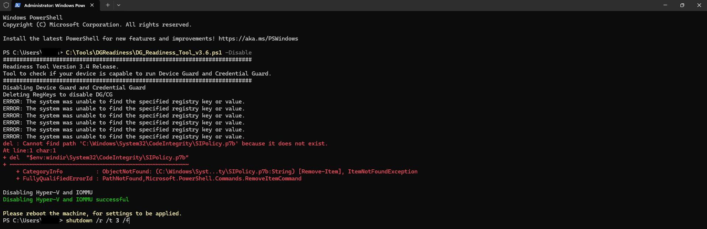

# Disabling Virtualization Based Security (VBS) on Windows 11 23H2+

## Problem Description

Starting with Windows 11 23H2, Microsoft automatically enables Virtualization Based Security (VBS) and Device Guard by default. This causes performance issues with virtualization software like VirtualBox and VMware:

- **VirtualBox**: Green turtle icon appears in VM status bar, indicating Hyper-V presence and lack of hardware acceleration
- **VMware**: Significantly slower performance due to inability to use hardware virtualization features
- **Performance Impact**: VMs run in software emulation mode instead of using CPU virtualization extensions

## Symptoms

- VirtualBox displays green turtle icon in status bar
- VMware VMs run extremely slowly
- Nested virtualization warnings in virtualization software
- Hardware acceleration unavailable for guest VMs

## Root Cause

Windows 11 23H2+ automatically enables:
- Virtualization Based Security (VBS)
- Device Guard / Credential Guard
- Hyper-V hypervisor layer

These features prevent other hypervisors (VirtualBox, VMware) from accessing hardware virtualization features directly.

## Solution

Use Microsoft's official Device Guard and Credential Guard hardware readiness tool to properly disable VBS.

### Download the Tool

**Official Microsoft Download Page:**
https://www.microsoft.com/en-us/download/details.aspx?id=53337

**Direct Download Link:**
https://download.microsoft.com/download/b/d/8/bd821b1f-05f2-4a7e-aa03-df6c4f687b07/dgreadiness_v3.6.zip

### Steps to Disable VBS

1. **Extract** the downloaded zip file to a folder (e.g., `C:\Tools\DGReadiness`)

2. **Open PowerShell as Administrator**

3. **Run the disable command:**
   ```powershell
   C:\<path_to_dg_readiness>\DG_Readiness_Tool_v3.6.ps1 -Disable
   ```

4. **Restart your computer:**
   ```powershell
   shutdown /r /t 30 /f
   ```



**Pro Tip - Quick Repeat Workflow:**
If VBS keeps re-enabling after Windows updates, you can quickly re-run the disable process:
1. Open PowerShell as Administrator
2. Press UP UP Enter (recalls previous DG tool command)
3. Press UP UP Enter (recalls previous shutdown command)

PowerShell command history makes it easy to repeat the process when needed.

### What the Tool Does

The DG Readiness Tool performs the following actions:
- Removes VBS-related registry keys
- Disables Hyper-V hypervisor via DISM
- Removes Device Guard policies
- Disables IOMMU (on older Windows versions)
- Cleans up Credential Guard configuration

### Important Notes

- **Permanent Solution**: The `-Disable` flag should permanently disable VBS
- **Re-enabling Issue**: If VBS re-enables after updates, it may be due to:
  - Group Policy enforcement
  - Windows Updates resetting configuration
  - Enterprise management policies
- **Security Impact**: Disabling VBS reduces some security features but improves virtualization performance

### Alternative Manual Methods (Less Reliable)

If the DG tool doesn't work, you can try these manual registry/bcdedit commands, though they're less reliable on 23H2+:

```powershell
# Disable via bcdedit
bcdedit /set hypervisorlaunchtype off

# Registry changes
REG DELETE "HKLM\SYSTEM\CurrentControlSet\Control\DeviceGuard" /v "EnableVirtualizationBasedSecurity" /f
REG DELETE "HKLM\SYSTEM\CurrentControlSet\Control\DeviceGuard" /v "RequirePlatformSecurityFeatures" /f
```

### Checking VBS Status

**Easy Method - System Information:**
1. Press `Win + R`, type `msinfo32` and press Enter
2. Look for **"Virtualization-based security"** in the system summary
3. If it shows **"Running"** - VBS is enabled and will cause slow virtualization
4. If it shows **"Not enabled"** or is missing - VBS is disabled


**PowerShell Method:**
```powershell
# Check VBS status
Get-CimInstance -ClassName Win32_DeviceGuard -Namespace root\Microsoft\Windows\DeviceGuard

# VirtualizationBasedSecurityStatus should be 0 (disabled)
```

### Verification After Disable

After restart, verify VBS is disabled using either method above. The "Virtualization-based security" line should show "Not enabled" or something similar.

### References

- [Microsoft DG Readiness Tool Documentation](https://www.microsoft.com/en-us/download/details.aspx?id=53337)
- [ElevenForum Discussion on VBS Disable Issues](https://www.elevenforum.com/t/virtualization-based-security-cannot-be-disabled-in-23h2.25259/)
- [Windows 10 threat protection Documentation](https://learn.microsoft.com/en-us/previous-versions/windows/it-pro/windows-10/security/threat-protection/)